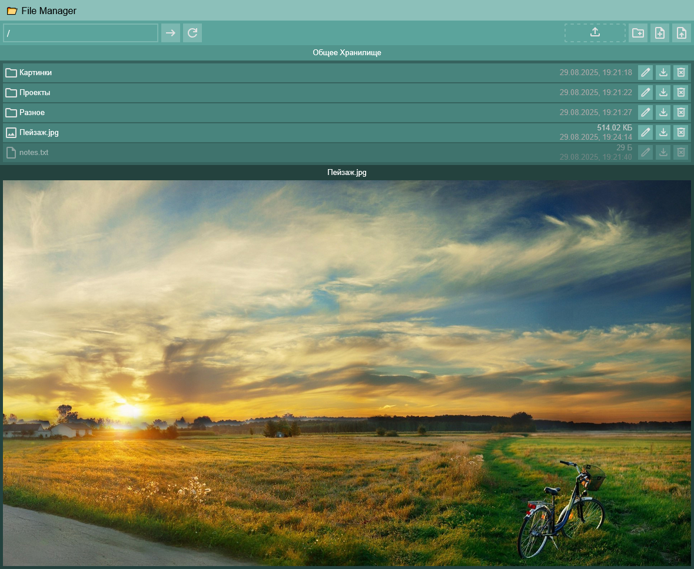

# Web-FileManager

English | [Русский](README_RU.md) | [Українська](README_UA.md)

## Launch

1. Install `python` and `nodejs`.
2. Run `run.sh`.

## Information

- All files are stored in the `data/` directory.

## Notes

- Each directory can have notes.

1. Create `notes.txt` in the desired directory.
2. Write text in `notes.txt`.
3. Notes will appear in the same directory as `notes.txt`.

## Preview

- Click on files to preview them.
- Supported files:
  - `txt`, `json`, `md`
  - `jpg`, `jpeg`, `png`, `gif`, `bmp`, `webp`

## Screenshot

