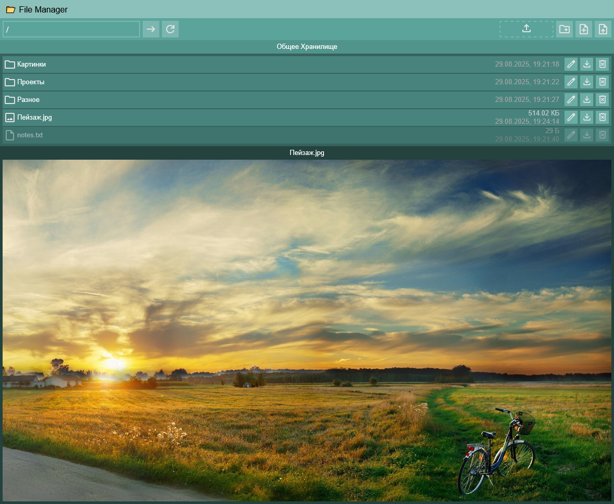

# Web-FileManager

[English](README.md) | [Русский](README_RU.md) | Українська

## Запуск

1. Встановити `python` і `nodejs`.
2. Запустити `run.sh`.

## Інформація

- Усі файли зберігаються в `data/` каталозі.

## Нотатки

- У кожного каталогу можуть бути нотатки.

1. Створіть `notes.txt` у потрібному каталозі.
2. Напишіть текст у `notes.txt`.
3. Нотатки з'являться в тому ж каталозі, що й `notes.txt`.

## Попередній перегляд

- Натисніть на файли, щоб переглянути їх.
- Підтримувані файли:
  - `txt`, `json`, `md`
  - `jpg`, `jpeg`, `png`, `gif`, `bmp`, `webp`

## Скріншот

